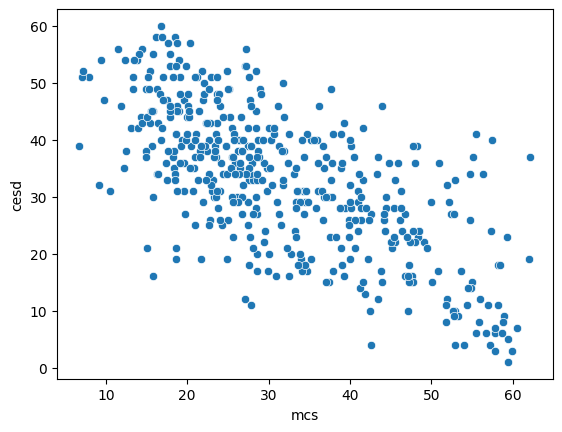
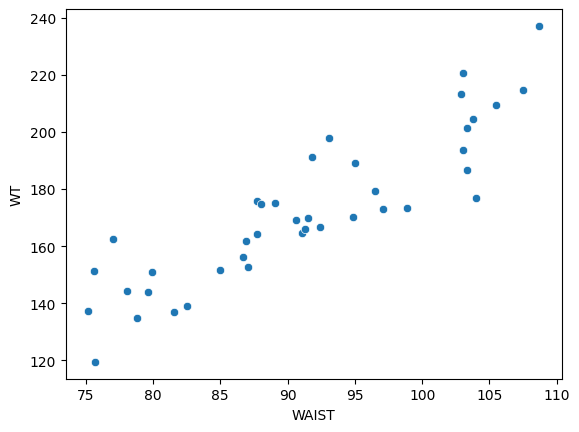
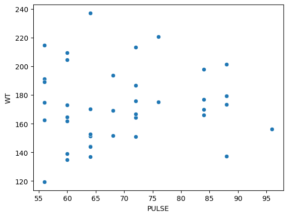

# Chapter 1: Introduction


```
python

from IPython.display import Markdown
base_path = (
    "https://raw.githubusercontent.com/rezahabibi96/GitBook/refs/heads/main/"
    "books/applied-statistics-wuth-python/.resources"
)

base_path = "https://raw.githubusercontent.com/leonkag/Statistics0/main"
```


## Introduction to Statistics

Statistics is the science of working with data collection (-polls, surveys, experiments, etc.) and subsequent data analysis and interpretation. It has become an integral part of almost every subject from Business and Economics to Medicine, Biology, Engineering, etc.

Consider a typical example from Medicine. A new cholesterol-reducing drug is invented and its efficacy needs to be tested against a standard drug used in medical practice. In the study of 200 patients who had high cholesterol, each one was randomly assigned to one of the two groups:

**Treatment group** - 98 patients treated with the new drug.

**Control group** - 102 patients treated with the standard drug

The results were assessed after a month. For the treatment group, 77/98 = 0.786 = 78.6 % had more than 10 points reduction in their cholesterol levels. In the control group, 75/102 = 0.735 = 73.5 % had more than 10 points reduction in their cholesterol levels.

The treatment group had about 5% better chance of having a sizeable cholesterolreduction. The main question of Statistics is if it happened by chance or if it is astatistically significant result. There are always natural variations (fluctuations) in
any data - a perfectly fair coin flipped 200 times does not land on 100 heads and 100 tails. Each such trial would come out slightly differently. Then the question becomes, how likely is it to obtain a 5% difference if the new drug and old drug perform about the same? We have to wait until a later chapter to develop computational tools to answer this question, but intuitively, the larger the difference, the less probable it is to obtain it by chance.

## Data Introduction

The files have to be in the right data format for Statistical software to read and analyze. Two standard files will be used extensively: HELPrct (medical data on substance abusers) and CPS85 (-economics data on hourly wages). We show the summary of a
portion of the first file below. The lines of Python code are commented out with text starting with a hashtag #. These are explanations for us humans to understand what is going on. Python approaches Statistics and Data Science by introducing many libraries like pandas imported below. Pandas library has the command *read_csv()* that reads in data files in comma-separated-values (.csv) format, which is used below. The. *shape* command shows that there are 453 substance abusers in the HELPrct file with 31columns describing them. Here, we show only a very small portion of it selecting variables (columns) of interest with double brackets `mydata[[‘cesd’,...]]`.


<details>
<summary>show / hide</summary>

```
python

import pandas as pd # pandas library works with data frames in Python


url = f'{base_path}/HELPrct.csv'
mydata = pd.read_csv(url) # save as mydata file

print('Data Frame dimensions: ', mydata.shape) # #rows and # cols

mydata = mydata[['cesd','age','mcs','pcs','homeless','substance','sex']];
mydata # NOTE that Python counts from row 0!!!

```

</details>


    Data Frame dimensions:  (453, 31)


<div>
<style scoped>
    .dataframe tbody tr th:only-of-type {
        vertical-align: middle;
    }

    .dataframe tbody tr th {
        vertical-align: top;
    }

    .dataframe thead th {
        text-align: right;
    }
</style>
<table border="1" class="dataframe">
  <thead>
    <tr style="text-align: right;">
      <th></th>
      <th>cesd</th>
      <th>age</th>
      <th>mcs</th>
      <th>pcs</th>
      <th>homeless</th>
      <th>substance</th>
      <th>sex</th>
    </tr>
  </thead>
  <tbody>
    <tr>
      <th>0</th>
      <td>49</td>
      <td>37</td>
      <td>25.111990</td>
      <td>58.413689</td>
      <td>housed</td>
      <td>cocaine</td>
      <td>male</td>
    </tr>
    <tr>
      <th>1</th>
      <td>30</td>
      <td>37</td>
      <td>26.670307</td>
      <td>36.036942</td>
      <td>homeless</td>
      <td>alcohol</td>
      <td>male</td>
    </tr>
    <tr>
      <th>2</th>
      <td>39</td>
      <td>26</td>
      <td>6.762923</td>
      <td>74.806328</td>
      <td>housed</td>
      <td>heroin</td>
      <td>male</td>
    </tr>
    <tr>
      <th>3</th>
      <td>15</td>
      <td>39</td>
      <td>43.967880</td>
      <td>61.931679</td>
      <td>housed</td>
      <td>heroin</td>
      <td>female</td>
    </tr>
    <tr>
      <th>4</th>
      <td>39</td>
      <td>32</td>
      <td>21.675755</td>
      <td>37.345585</td>
      <td>homeless</td>
      <td>cocaine</td>
      <td>male</td>
    </tr>
    <tr>
      <th>...</th>
      <td>...</td>
      <td>...</td>
      <td>...</td>
      <td>...</td>
      <td>...</td>
      <td>...</td>
      <td>...</td>
    </tr>
    <tr>
      <th>448</th>
      <td>28</td>
      <td>33</td>
      <td>41.943066</td>
      <td>56.968681</td>
      <td>housed</td>
      <td>heroin</td>
      <td>male</td>
    </tr>
    <tr>
      <th>449</th>
      <td>37</td>
      <td>49</td>
      <td>62.175503</td>
      <td>57.253838</td>
      <td>housed</td>
      <td>alcohol</td>
      <td>male</td>
    </tr>
    <tr>
      <th>450</th>
      <td>28</td>
      <td>39</td>
      <td>33.434536</td>
      <td>40.045715</td>
      <td>homeless</td>
      <td>heroin</td>
      <td>female</td>
    </tr>
    <tr>
      <th>451</th>
      <td>11</td>
      <td>59</td>
      <td>54.424816</td>
      <td>53.732044</td>
      <td>homeless</td>
      <td>cocaine</td>
      <td>male</td>
    </tr>
    <tr>
      <th>452</th>
      <td>35</td>
      <td>45</td>
      <td>30.212227</td>
      <td>43.476074</td>
      <td>homeless</td>
      <td>alcohol</td>
      <td>male</td>
    </tr>
  </tbody>
</table>
<p>453 rows × 7 columns</p>
</div>


The file above has a data frame (data matrix) form. Each row (case) is a patient, and each column is a variable describing that patient. Variables have different types. The `age`, `cesd` (depression score), `mcs` (mental health score), and `pcs` (physical health score) are all numerical (quantitative) variables. The `homeless`, `sex`, and `substance` are all categorical (qualitative) variables (labels).


The CPS85.csv data set on wages is shown below:


<details>
<summary>show / hide</summary>

```
python

url = f'{base_path}/CPS85.csv'
mydata = pd.read_csv(url)

print('Data Frame dimensions: ', mydata.shape)

mydata = mydata[['wage','educ','race','sex','south','married','exper','sector']]
mydata.head(10)
```

</details>


    Data Frame dimensions:  (534, 12)


<div>
<style scoped>
    .dataframe tbody tr th:only-of-type {
        vertical-align: middle;
    }

    .dataframe tbody tr th {
        vertical-align: top;
    }

    .dataframe thead th {
        text-align: right;
    }
</style>
<table border="1" class="dataframe">
  <thead>
    <tr style="text-align: right;">
      <th></th>
      <th>wage</th>
      <th>educ</th>
      <th>race</th>
      <th>sex</th>
      <th>south</th>
      <th>married</th>
      <th>exper</th>
      <th>sector</th>
    </tr>
  </thead>
  <tbody>
    <tr>
      <th>0</th>
      <td>9.00</td>
      <td>10</td>
      <td>W</td>
      <td>M</td>
      <td>NS</td>
      <td>Married</td>
      <td>27</td>
      <td>const</td>
    </tr>
    <tr>
      <th>1</th>
      <td>5.50</td>
      <td>12</td>
      <td>W</td>
      <td>M</td>
      <td>NS</td>
      <td>Married</td>
      <td>20</td>
      <td>sales</td>
    </tr>
    <tr>
      <th>2</th>
      <td>3.80</td>
      <td>12</td>
      <td>W</td>
      <td>F</td>
      <td>NS</td>
      <td>Single</td>
      <td>4</td>
      <td>sales</td>
    </tr>
    <tr>
      <th>3</th>
      <td>10.50</td>
      <td>12</td>
      <td>W</td>
      <td>F</td>
      <td>NS</td>
      <td>Married</td>
      <td>29</td>
      <td>clerical</td>
    </tr>
    <tr>
      <th>4</th>
      <td>15.00</td>
      <td>12</td>
      <td>W</td>
      <td>M</td>
      <td>NS</td>
      <td>Married</td>
      <td>40</td>
      <td>const</td>
    </tr>
    <tr>
      <th>5</th>
      <td>9.00</td>
      <td>16</td>
      <td>W</td>
      <td>F</td>
      <td>NS</td>
      <td>Married</td>
      <td>27</td>
      <td>clerical</td>
    </tr>
    <tr>
      <th>6</th>
      <td>9.57</td>
      <td>12</td>
      <td>W</td>
      <td>F</td>
      <td>NS</td>
      <td>Married</td>
      <td>5</td>
      <td>service</td>
    </tr>
    <tr>
      <th>7</th>
      <td>15.00</td>
      <td>14</td>
      <td>W</td>
      <td>M</td>
      <td>NS</td>
      <td>Single</td>
      <td>22</td>
      <td>sales</td>
    </tr>
    <tr>
      <th>8</th>
      <td>11.00</td>
      <td>8</td>
      <td>W</td>
      <td>M</td>
      <td>NS</td>
      <td>Married</td>
      <td>42</td>
      <td>manuf</td>
    </tr>
    <tr>
      <th>9</th>
      <td>5.00</td>
      <td>12</td>
      <td>W</td>
      <td>F</td>
      <td>NS</td>
      <td>Married</td>
      <td>14</td>
      <td>sales</td>
    </tr>
  </tbody>
</table>
</div>


Variables `wage`, `age`, `educ`, and `exper` are numerical, while `race`, `sex`, `south`, `married`, and `sector` are categorical.

Lastly, MHEALTH.csv data file contains a lot of information about the health measures of 40 males. All variables are numerical.


<details>
<summary>show / hide</summary>

```
python

url = f'{base_path}/MHEALTH.csv'
mydata = pd.read_csv(url)

print('Data Frame dimensions: ', mydata.shape)

mydata = mydata[['AGE','HT','WT','WAIST','PULSE','BMI']];
mydata.head(10)
```

</details>


    Data Frame dimensions:  (40, 14)


<div>
<style scoped>
    .dataframe tbody tr th:only-of-type {
        vertical-align: middle;
    }

    .dataframe tbody tr th {
        vertical-align: top;
    }

    .dataframe thead th {
        text-align: right;
    }
</style>
<table border="1" class="dataframe">
  <thead>
    <tr style="text-align: right;">
      <th></th>
      <th>AGE</th>
      <th>HT</th>
      <th>WT</th>
      <th>WAIST</th>
      <th>PULSE</th>
      <th>BMI</th>
    </tr>
  </thead>
  <tbody>
    <tr>
      <th>0</th>
      <td>20</td>
      <td>69.7</td>
      <td>137.4</td>
      <td>75.2</td>
      <td>88</td>
      <td>19.9</td>
    </tr>
    <tr>
      <th>1</th>
      <td>25</td>
      <td>67.6</td>
      <td>151.3</td>
      <td>75.6</td>
      <td>64</td>
      <td>23.3</td>
    </tr>
    <tr>
      <th>2</th>
      <td>34</td>
      <td>63.7</td>
      <td>119.5</td>
      <td>75.7</td>
      <td>56</td>
      <td>20.7</td>
    </tr>
    <tr>
      <th>3</th>
      <td>29</td>
      <td>70.0</td>
      <td>162.4</td>
      <td>77.0</td>
      <td>56</td>
      <td>23.4</td>
    </tr>
    <tr>
      <th>4</th>
      <td>22</td>
      <td>66.2</td>
      <td>144.2</td>
      <td>78.1</td>
      <td>64</td>
      <td>23.2</td>
    </tr>
    <tr>
      <th>5</th>
      <td>41</td>
      <td>66.5</td>
      <td>135.0</td>
      <td>78.8</td>
      <td>60</td>
      <td>21.5</td>
    </tr>
    <tr>
      <th>6</th>
      <td>26</td>
      <td>68.5</td>
      <td>144.1</td>
      <td>79.6</td>
      <td>64</td>
      <td>21.6</td>
    </tr>
    <tr>
      <th>7</th>
      <td>20</td>
      <td>66.3</td>
      <td>151.0</td>
      <td>79.9</td>
      <td>72</td>
      <td>24.2</td>
    </tr>
    <tr>
      <th>8</th>
      <td>36</td>
      <td>70.3</td>
      <td>137.1</td>
      <td>81.6</td>
      <td>64</td>
      <td>19.6</td>
    </tr>
    <tr>
      <th>9</th>
      <td>54</td>
      <td>65.6</td>
      <td>139.0</td>
      <td>82.5</td>
      <td>60</td>
      <td>22.7</td>
    </tr>
  </tbody>
</table>
</div>


In addition, numerical (quantitative) variables can be subdivided into **discrete** and **continuous**. **Discrete variables** can only take on distinct, separate values, which are typically counted in whole numbers (0,1,2,. . . ). Unlike
**continuous variables**, which can take on any value within a range, discrete variables have a finite or countably infnite number of possible values. For example, the number of students in a class, the number of cars in a garage, the number of books on a shelf, etc. are discrete, while distance, time, height, weight, etc. are continuous.

Categorical (qualitative) variables can also be subdivided into nominal and ordinal. Nominal variables represent categories or labels without any inherent order or relationship. For example, gender, eye color, marital status, experimental group (Treatment vs. Control), country, etc. The values of nominal variables are called levels. Ordinal variables are categorical variables that have order or ranking, but the intervals in between the levels are not necessarily uniform or meaningful. For example, education level (high school < bachelor < master < Ph.D.), income (low < medium < high), and Likert scale in surveys (strongly disagree < disagree < neutral < agree < strongly agree).

For numerical variables both discrete and continuous, numerical statistics likemean, and median, as well as transformations, make sense. For categorical variables, whether nominal or ordinal, only counting in each group (level) makes sense. Also note that there are some variables represented via numbers that are categorical, like zip codes. The mean zip code of students in a class doesn't make any sense.

In addition to the individual variable classifcation, relationships between variables play an important role in Statistics. For two numerical variables, a scatterplot illustrates a possible relationship. For example, consider the dependence between `cesd` depression score and `mcs` mental score for substance abusers shown in the Figure below:


<details>
<summary>show / hide</summary>

```
python

import seaborn as sns # - seaborn is a Statistics graphics library


url = f'{base_path}/HELPrct.csv'
mydata = pd.read_csv(url) 

sns.scatterplot(data=mydata, x="mcs", y="cesd");

```

</details>


    

    


Not surprisingly, as the mental score becomes higher, the depression score decreases, so these variables are **negatively associated (dependent)**. In this setting, the x-axis mcs would be an **explanatory (independent, predictor) variable**, while the y-axis cesd would be a **response (dependent) variable**. On the other hand, men's weight (`WT`) is **positively associated** with waist measurement (`WAIST`) as shown in the Figure below.


<details>
<summary>show / hide</summary>

```
python

url = f'{base_path}/MHEALTH.csv'
mydata = pd.read_csv(url)

sns.scatterplot(data=mydata, x="WAIST", y="WT");
```

</details>


    

    


Finally, men's weight (`WT`) is **not associated (independent)** with pulse (`PULSE`) as shown in Figure below.


<details>
<summary>show / hide</summary>

```
python

sns.scatterplot(data=mydata, x="PULSE", y="WT");
```

</details>


    

    


Remember that **association does not imply causation**. The `mcs` does not cause the reduction in `cesd` score; they are just measurements of depression and mental state which are related to each other. A classic example of association without causation is NYC subway fare and average pizza slice price, which have stayed almost the same throughout the years since the 1950s. Both prices have grown over the years due to inflation, etc., not one causing the another.

The data is collected in two primary ways: **observational studies and experiments**. If researchers do not directly interfere with how the data arises, it is an **observational study**. The data sets considered in this section are all observational. Any opinion polls, surveys, etc. are observational. A study looking back in time at medical or business records (*retrospective studies*), and *prospective studies* where a cohort (group) of similar individuals is followed over many years into the future are all observational. **Experiments**, however, involve manipulating one or more independent variables to observe their efect on a dependent variable. The example at the beginning of the chapter on the effects of a new cholesterol-reducing drug was an experimental study. Researchers randomized patients into treatment and control groups and proportions were compared. The explanatory group variable has two levels (treatment and control). The proportions by group are the responses. *Observational studies may only show the association/relationship between variables, not cause and effect. Only a carefully designed randomized experiment may be used to establish cause and effect*.

To illustrate why it would be wrong to infer cause and effect based on a simple association, let's consider the following example. A medical study focusing on blood pressure and mortality may find that low blood pressure is associated with a higher risk of mortality. However, it does not cause death directly, rather, it is due to the confounding effect of heart disease. A variable that is associated with both the explanatory (low blood pressure) and response variable (mortality) but is not directly accounted for by the study is called a **confounding (lurking) variable**. There are ways to account for confounding variables; they should not be dismissed

## Sampling Methods

In statistics, a **population** is the pool of all individuals or items from which a much smaller **statistical sample** is drawn for a study. For example, in the drug study considered before, 200 patients with high cholesterol constitute a random sample out of the whole population of such patients. It is impractical to take **census** of the entire population, instead, a small randomized sample is considered. For example, presidential approval polls are conducted almost every day. It is impossible each time to run a census of many millions of American voters, so a much smaller 1200-1500 random sample is obtained. A sample should be **representative of a target population**, which is not an easy task undertaken by polling agencies. Most of them failed to correctly predict Donald Trump's election in 2016 missing new "Trump Voters" giving him an edge. A characteristic of the entire population is called a **parameter** and denoted by a Greek letter like a population mean µ. The same quantity measured on a sample is called a **statistic** denoted by a regular letter with some special sign like a sample mean $\bar{x}$.

In Statistics, we almost always use a **simple random sample** - an **unbiased** approach where a subset is chosen randomly with all items equally likely to be selected (like a computerized raffle). Systematic bias is different from natural variation in the data, and cannot be corrected by any statistical techniques. For example, a survey on smartphone usage conducted on tech-savvy young users would be highly inaccurate in reflecting the entire population's phone usage.

Another possible flaw in sampling is a **voluntary response** sample. For example, a voting questionnaire was mailed to a large sample of individuals, but only a much smaller sub-sample responded corresponding to a high **non-response rate**. It could be that most people who felt strongly about the election responded, which would produce an additional *bias*. Similarly, self-selected polls of viewers of highly partisan networks like FOX and MSNBC are not representative of the entire population. There are other more specialized sampling techniques like **stratified sampling**, **cluster sampling**, etc., but they are mostly used in polling and will not be considered in this textbook.

## Statistical Experiments

In this section, we consider **randomized experimental design** that involves randomly assigning participants to different experimental conditions to control for confounding and allow causal inferences. A control group must always be included to provide a baseline for comparison with one or more of the experimental groups. For example, in the new drug study described at the beginning of the chapter, there was a control group of patients taking the standard drug. Also, the patients in the two groups should take the new drug and the standard one in a similar manner, say after a meal, same time of the day, etc. Randomization can be achieved via random number generators. This helps to account for other variables that cannot be controlled. For example, some patients may be healthier due to their lifestyle, so randomizing helps to even out such differences and avoid bias. The experiment should be replicated a sufficient number of times with different samples and/or in different settings. It strengthens the confidence in being able to generalize the observed effects to a much larger population.

In some studies, a **randomized block design** is called for that involves dividing participants into homogeneous blocks before random assignment. It can be particularly useful when there are factors that may influence the outcome but are not the primary focus of the study (confounding variables). For example, considering again the new drug experiment, it seems logical to assume that the drug reaction could be different for patients with moderately high cholesterol levels (moderate) vs. patients with very high cholesterol levels (high). Therefore, we create a blocking variable Chol with two levels of moderate and high, separate all 200 patients according to this variable, and then take simple random samples of equal sizes from moderate and high groups, respectively. This strategy ensures each treatment group has an equal number of moderate and high cholesterol level patients.

In addition, it is important to reduce unintended human bias via **double blinding** where neither the patient nor the doctor knows whether a particular patient is on a new drug or a standard drug. If a new drug is tested against no treatment, the patients in the control (no treatment) group should still receive a placebo to avoid possible **placebo effects**.

## Roadmap for the Book

At the end of this first chapter of the book, let's discuss the roadmap for the rest of the text. In this chapter, some of the basic ideas of Statistics have been introduced. The next chapter reviews the main approaches of **Descriptive Statistics**. It summarizes a sample in terms of means, standard deviations, and counts as well as introduces important visualizations like histograms, boxplots, etc. Within the descriptive approach, we only try to describe the sample at hand, not to infer anything about the larger population from which it came; that would be the task of **Inferential Statistics**.

The inferential Statistics method uses sample statistics to make inferences about population parameters. First, however, basic probability ideas and probability distributions relevant to Statistics (normal and binomial) must be introduced/reviewed. The next chapters introduce the main approaches of inferential statistics such as confidence intervals and hypothesis testing. They are applied to both categorical and numerical data leading to proportions, goodness of fit, independence, and means tests. Next, Part 2 of the book will look at more advanced topics such as ANOVA, linear and nonlinear models, multiple and logistic regression, tree models, principal component analysis, clustering, etc.
